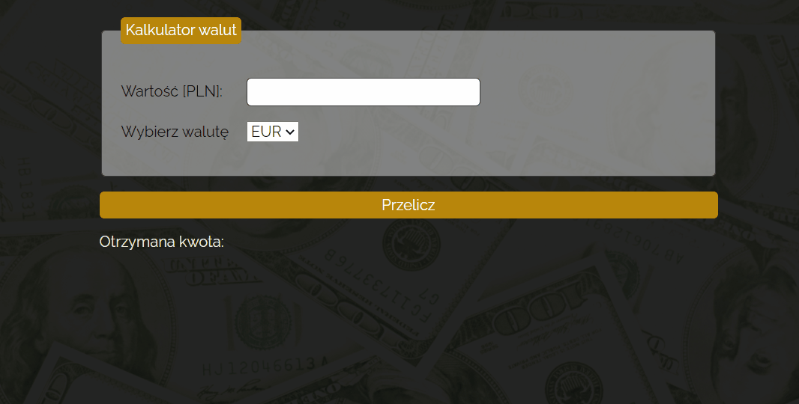

# Welcome to my Currency Converter!
It's a simple website where you can convert currency values based on 15.01.2022 day exchange values. This calculator lets you convert PLN to EUR, GBP and JPY.

Here's the link: [Currency Converter](https://weronikabrozek.github.io/currency_converter/)

## How to use it?
To use calculator, provide amount of money you want to convert and then choose desired currency using the drop-down. To see the result just click on button ```Przelicz```. 
> When providing amount you can also use arrows on right side of the field and change it with small steps (0.01).


Example of use:


## Technologies
Project is created with:
* HTML (BEM),
* CSS,
* Java Script ES6.

